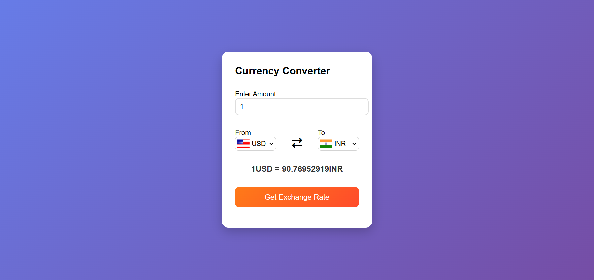

# 💱 Currency Converter Web App


A modern, responsive **Currency Converter Web Application** built using **HTML, CSS, and JavaScript**. This project allows users to convert currencies in real-time using live exchange rates from a public API.

Designed with clean UI, smooth animations, and an intuitive user experience — perfect for portfolio showcase.

---

## 🚀 Live Demo

🔗 **[View Live Project](#)**
_(Add your deployed link here — GitHub Pages / Netlify / Vercel)_

---

## 📸 Preview



_(Add your screenshot inside an `assets` folder and name it preview.png)_

---

## ✨ Features

- 🌍 Convert between multiple world currencies
- 🔄 Real-time exchange rates using API
- 🎨 Clean and modern UI design
- ⚡ Fast and lightweight
- 📱 Fully responsive
- 🚩 Dynamic country flag updates
- ✨ Smooth animations and modern UI
- 🎯 Beginner-friendly and easy-to-understand code

---

## 🛠️ Tech Stack

**Frontend**

- HTML5 – Structure
- CSS3 – Styling & animations
- JavaScript (ES6) – Logic & API handling

**API**

- Currency API - Exchange Rate
- Flag API - Country FLags

---

## 📂 Project Structure

```
currency-converter/
│
├── index.html        # Main HTML file
├── style.css         # Styling file
├── script.js         # JavaScript logic
├── assets/           # Images and icons
│   └── preview.png
└── README.md        # Project documentation
```

---

## ⚙️ How It Works

1. User enters amount
2. Selects "From" currency
3. Selects "To" currency
4. Clicks convert
5. JavaScript fetches exchange rate from API
6. Converted value is displayed instantly

---

## 📦 Installation & Setup

Clone the repository:

```bash
git clone https://github.com/Arnav-Sirkhal/currency-converter.git
```

Open the project folder:

```bash
cd currency-converter
```

Run the project:

Simply open `index.html` in your browser.

---

## 🧠 Learning Objectives

This project demonstrates:

- DOM manipulation
- Fetch API usage
- Async / Await
- Event handling
- CSS animations & transitions
- Clean project structure

---

## 🎨 UI Highlights

- Smooth fade-in animation
- Responsive layout
- Modern color scheme

---

## 👨‍💻 Author

**Your Name**
GitHub: https://github.com/Arnav-Sirkhal

---

## ⭐ Support

If you like this project, please give it a ⭐ on GitHub!

---
